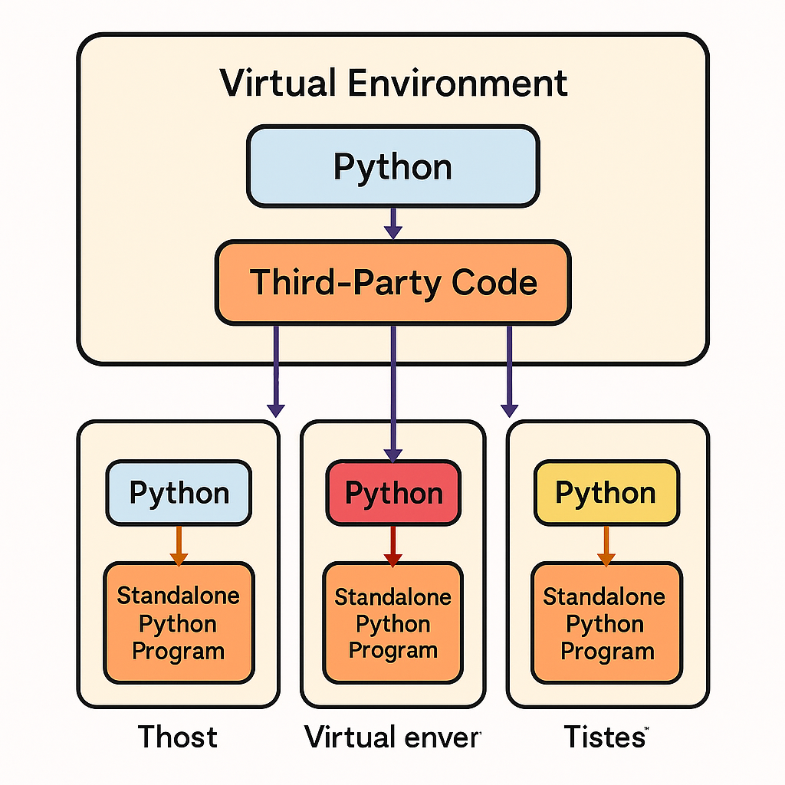

📝 Notes on Python Virtual Environment (venv)
💡 Why Virtual Environment?

Keeps your project dependencies isolated.

Prevents conflicts when different projects need different versions of libraries.

Makes your project portable → can run on other machines (Windows, Mac, Linux) without issues.

Good practice → always use virtual environments.

🛠 How Virtual Environment Works

Normally: All Python projects share the same installed libraries → version conflicts.

With venv: Each project has its own copy of Python + dependencies inside a separate folder.

Your system Python stays clean.

# Virtual Environment Notes

## Why Virtual Environment?
- Keeps dependencies isolated
- Prevents conflicts
- Portable across systems

## Diagram

👉 The diagram shows how each project gets its **own copy of Python** and libraries.

🔑 Key Commands
1. Create a Virtual Environment
# Mac/Linux
python3 -m venv venv  

# Windows
python -m venv venv

👉 Here venv is the folder name (you can use .venv, env, or any name).

2. Activate the Virtual Environment

Windows (Command Prompt / PowerShell):

venv\Scripts\activate

Mac/Linux:

source venv/bin/activate

👉 After activation, you’ll see (venv) at the start of your terminal prompt.

3. Install Packages
pip install flask
pip install requests

👉 These get installed only in this venv, not globally.

4. Save Dependencies
pip freeze > requirements.txt

👉 Creates a file listing all installed packages with versions.

5. Install from requirements.txt
pip install -r requirements.txt

👉 Recreates the same environment on another computer.

6. Deactivate Environment
deactivate

7. Delete Environment (optional)

Simply delete the venv/ folder.
👉 You don’t share this folder in Git → put it inside .gitignore.

🚀 Best Practices

Always create a venv for each project.

Always use requirements.txt to share dependencies.

Never commit your venv folder to GitHub.

Use pip freeze > requirements.txt before sharing your project.

✅ Step-by-Step (Super Easy)

Make a project folder → mkdir myproject && cd myproject.

Create virtual env → python3 -m venv venv (Mac/Linux) or python -m venv venv (Windows).

Activate → source venv/bin/activate (Mac/Linux) or venv\Scripts\activate (Windows).

Install libraries → pip install flask requests.

Save dependencies → pip freeze > requirements.txt.

Share only requirements.txt + your code.

Others can recreate your environment with → pip install -r requirements.txt.

When done → deactivate.

Best Practices

Always create venv for each project.
Never push venv to GitHub (.gitignore).
Share only requirements.txt + your code.
Use (venv) in terminal as a reminder you’re inside.

⚡ Bonus: New modern tool UV (faster & easier than venv+pip). You’ll learn this later, but venv basics are must-know.